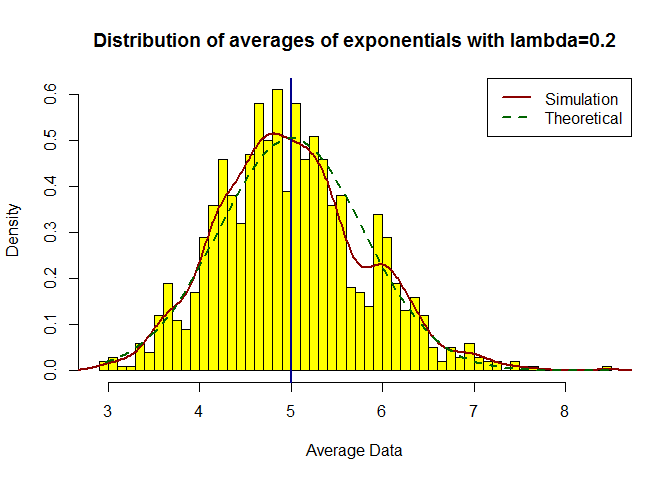
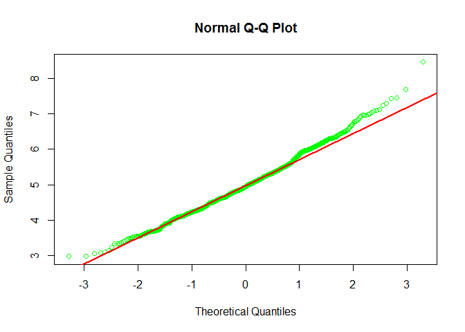

# Statistical Inference Course Project Part1: Simulation

### Simulation exercise 
The exponential distribution can be simulated in R with `rexp(n, lambda)` where `lambda` ($\lambda$) is the rate parameter. The mean of exponential distribution is `1/lambda` ($1/\lambda$) and the standard deviation is also `1/lambda` ($1/\lambda$). **Set `1/lambda = 0.2` ($1/\lambda$ = 0.2) for all of the simulations**. In this simulation, you will investigate the distribution of averages of 40 exponential(0.2)s. Note that you will need to do a thousand or so simulated averages of 40 exponentials.

Illustrate via simulation and associated explanatory text the properties of the distribution of the mean of 40 exponential(0.2)s.  You should

1. Show where the distribution is centered at and compare it to the theoretical center of the distribution.

2. Show how variable it is and compare it to the theoretical variance of the distribution.

3. Show that the distribution is approximately normal.

### Load packages

```r
packages <- c("ggplot2")
sapply(packages, require, character.only=TRUE, quietly=TRUE)
```

```
## ggplot2 
##    TRUE
```

First lets generate the data of 1000 simulated averages of 40 exponentially distributed random variables. The mean and standard deviation of the set of 40 variables for each trial is stored in to a dataset.

### Initilize and set parameters

```r
set.seed(100)
lambda <- 0.2
exponentials <- 40
simulations <- 1000
```

### Perform simulations and calculate 40 exponentials average

```r
simulatedData <- matrix(rexp(simulations * exponentials, rate=lambda), 
                                nrow = simulations, ncol = exponentials)
#head(simulatedData)

expoAvgData <- rowMeans(simulatedData)
head(expoAvgData)
```

```
## [1] 5.159714 5.006515 6.030689 5.268777 6.836385 5.116371
```

#### 1. Show where the distribution is centered at and compare it to the theoretical center of the distribution.

```r
# Calculate mean of distribution of averages for 40 exponentials
mean(expoAvgData)
```

```
## [1] 4.999702
```

```r
# mean from lambda
1/lambda
```

```
## [1] 5
```

### Plot the distribution of sample mean

```r
# Histogram plot of averages
hist(expoAvgData, breaks=50, prob=TRUE,
     main="Distribution of averages of exponentials with lambda=0.2",
     xlab="Average Data", col="yellow")

# Density of the averages of exponentials
lines(density(expoAvgData), col="dark red", lty=1, lwd=2)

# Theoretical center of the distribution
abline(v=1/lambda, col="dark blue", lty=1, lwd=2)

# Theoretical density of the averages of exponentials
seq <- seq(min(expoAvgData), max(expoAvgData), length=100)
norm <- dnorm(seq, mean=1/lambda, sd=(1/lambda/sqrt(exponentials)))
lines(seq, norm, col="dark green", lty=2, lwd=2)

# Legend
legend('topright', c("Simulation", "Theoretical"), lty=c(1,2), 
       col=c("dark red", "dark green"), lwd=c(2,2))
```

 

Based on the above observations, the distribution of averages of 40 exponentials is centered at `mean(expoAvgData)` = 4.9997019 and the same is close or near to the theoretical center of the distribution, which is $\lambda^{-1}$ = 5 ($1/\lambda$).    

### 2. Show how variable it is and compare it to the theoretical variance of the distribution.

```r
# standard deviation of the distribution of averages of 40 exponentials
sd(expoAvgData)
```

```
## [1] 0.7959461
```

```r
# standard deviation from analytical expression
(1/lambda)/sqrt(exponentials)
```

```
## [1] 0.7905694
```

```r
# variance of the exponentials mean
var(expoAvgData)
```

```
## [1] 0.6335302
```

```r
# Theoritcal variance of the distribution - 1/((lambda^2)* n)
1/((0.2*0.2) * 40)
```

```
## [1] 0.625
```

Based on the above results, the variance in the distribution of averages of 40 exponentials is close or near to the theoretical variance of the distribution. The variance of exponentials mean is `var(expoAvgData)` = 0.6335302 and theoretical variance of the distribution is $\sigma^2 / n = 1/(\lambda^2 n)$ = 0.625.  

The above figure also shows the density computed using the histogram and the normal density plotted with theoretical mean and variance values follow normal distribution and also the q-q plot below shows the same.

### 3. Show that the distribution is approximately normal.

```r
# qqplot and qqline to compare the distribution of averages of 40 exponentials to a normal distribution
qqnorm(expoAvgData, col="green", main = "Normal Q-Q Plot", xlab = "Theoretical Quantiles", 
       ylab = "Sample Quantiles", lwd = 1, plot.it = TRUE, datax = FALSE)
qqline(expoAvgData, col = "red", lwd = 2, datax = FALSE, distribution = qnorm)
```

 

Based on the above q-q plot, it also shows the distribution of averages of 40 exponentials is approximately close to a normal distribution.  

**Note:** Please see below **github** link for full code & reports (if required)

github -> https://github.com/mksaiprasad/StatisticalInference
