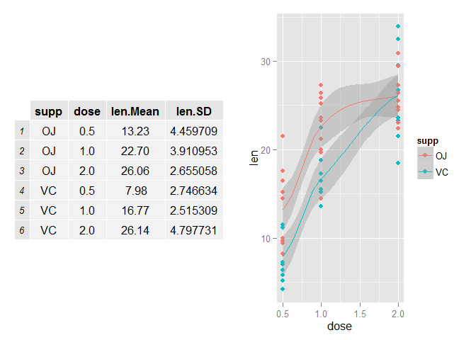
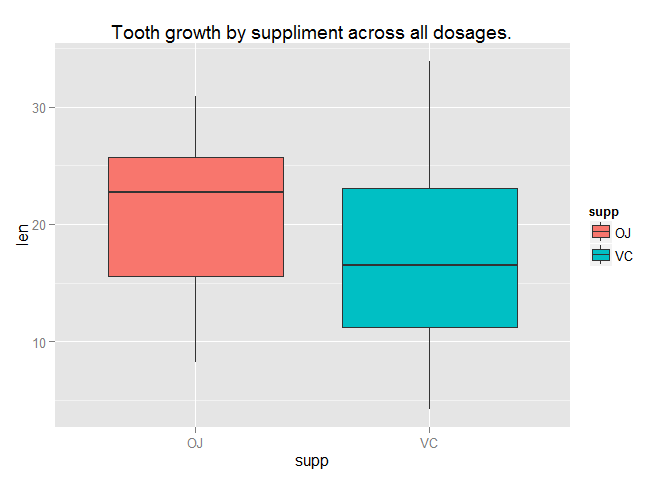

# Statistical Inference Course Project Part2: Basic inferential data analysis

### Basic inferential data analysis 
Now in the second portion of the class, we're going to analyze the ToothGrowth data in the R datasets package.

1. Load the ToothGrowth data and perform some basic exploratory data analyses 
2. Provide a basic summary of the data.
3. Use confidence intervals and/or hypothesis tests to compare tooth growth by supp and dose. (Only use the techniques from class, even if there's other approaches worth considering)
4. State your conclusions and the assumptions needed for your conclusions.  

Some criteria that you will be evaluated on

* Did you  perform an exploratory data analysis of at least a single plot or table highlighting basic features of the data?
* Did the student perform some relevant confidence intervals and/or tests?
* Were the results of the tests and/or intervals interpreted in the context of the problem correctly? 
* Did the student describe the assumptions needed for their conclusions?
    
#### Load packages

```r
packages <- c("datasets","ggplot2","grid","gridExtra")
sapply(packages, require, character.only=TRUE, quietly=TRUE)
```

```
##  datasets   ggplot2      grid gridExtra 
##      TRUE      TRUE      TRUE      TRUE
```

### 1. Load the ToothGrowth data and perform some basic exploratory data analyses


```r
# load the dataset and have a look
data(ToothGrowth)
str(ToothGrowth)
```

```
## 'data.frame':	60 obs. of  3 variables:
##  $ len : num  4.2 11.5 7.3 5.8 6.4 10 11.2 11.2 5.2 7 ...
##  $ supp: Factor w/ 2 levels "OJ","VC": 2 2 2 2 2 2 2 2 2 2 ...
##  $ dose: num  0.5 0.5 0.5 0.5 0.5 0.5 0.5 0.5 0.5 0.5 ...
```

```r
# Convert dose data to factor
dose <- as.factor(ToothGrowth$dose)
supp <- as.factor(ToothGrowth$supp)
```

### 2. Provide a basic summary of the data.  


```r
# See the Summary of all variables
summary(ToothGrowth)
```

```
##       len        supp         dose      
##  Min.   : 4.20   OJ:30   Min.   :0.500  
##  1st Qu.:13.07   VC:30   1st Qu.:0.500  
##  Median :19.25           Median :1.000  
##  Mean   :18.81           Mean   :1.167  
##  3rd Qu.:25.27           3rd Qu.:2.000  
##  Max.   :33.90           Max.   :2.000
```

Summary of means and standard deviations of each supplement and dose combination

```r
# Compute Summary stats for each and split the data into subsets for easy understanding.
agMean <- aggregate(len ~ . , data = ToothGrowth, FUN = mean )
agSD <- aggregate(len ~ . , data = ToothGrowth, FUN = sd )
agToothGrowth <- merge(agMean, agSD, by.x = c("supp", "dose"), by.y = c("supp", "dose"))
names(agToothGrowth) <- c("supp", "dose", "len.Mean", "len.SD")

# show tabular aggregated above data and  plot each supplement / dose combination 
qp <- qplot(dose, len, data=ToothGrowth, color = supp) 
suppressWarnings(qp <- qp + geom_smooth()) 
suppressWarnings(grid.arrange(tableGrob(agToothGrowth), qp, ncol=2))
```

 

Based on the above table & plot, OJ corresponds to greater tooth growth than VC across all dosages.

### 3. Use confidence intervals and hypothesis tests to compare tooth growth by supp and dose.  

95% confidence intervals for two variables are as below: 

 

```
## 
## 	Welch Two Sample t-test
## 
## data:  len by supp
## t = 1.9153, df = 55.309, p-value = 0.03032
## alternative hypothesis: true difference in means is greater than 0
## 95 percent confidence interval:
##  0.4682687       Inf
## sample estimates:
## mean in group OJ mean in group VC 
##         20.66333         16.96333
```

CI is entirely greater than 0, which suggests OJ corresponds to greater tooth growth.

### 4. State your conclusions and the assumptions needed for your conclusions

#### Based on the above data, the conclusions are:
1.By ignoring the supplement types, there is a significant difference in tooth growth between the dose levels, with higher doses resulting in longer teeth.

2.By considering dose levels and supplement types, OJ has greater tooth growth than VC at dose levels of 0.5 mg and 1.0 mg, but at dose level of 2.0 mg, there is no significant difference in tooth growth between the two supplement types.

#### Assumptions:
*  The populations are independent. 

* The measurements were unaware of the dosages and supplement types.

* Subjects are not identical in two groups. 

**Note:** Please see below **github** link for full code & reports (if required)

github -> https://github.com/mksaiprasad/StatisticalInference
